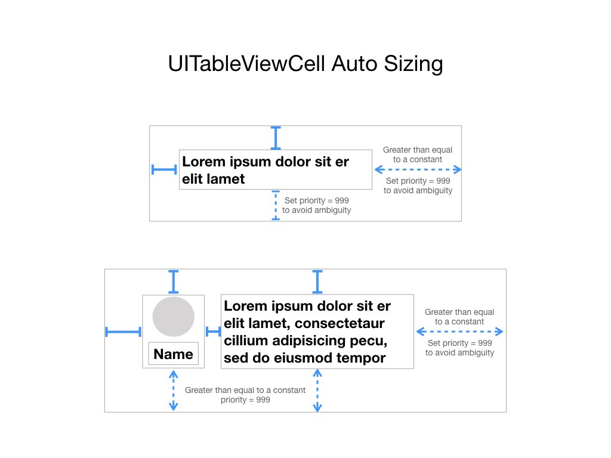
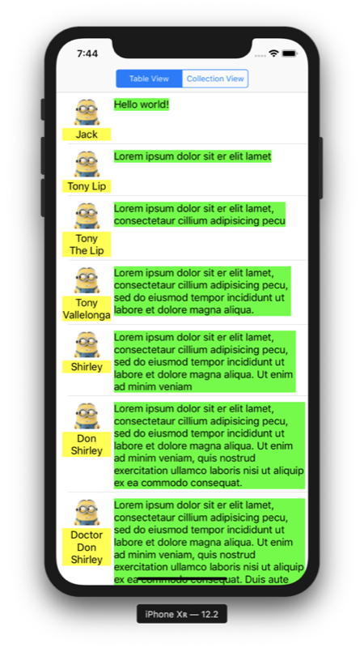

# AutoSizingCell

UITableView auto sizing code:

```
// Swift
tableView.rowHeight = UITableView.automaticDimension
tableView.estimatedRowHeight = 44
```

UITableView set auto sizing constraints:



Result:




